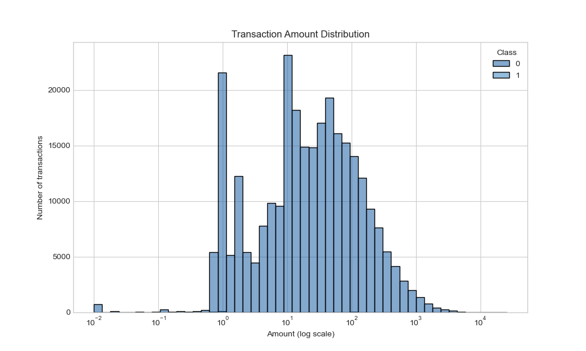
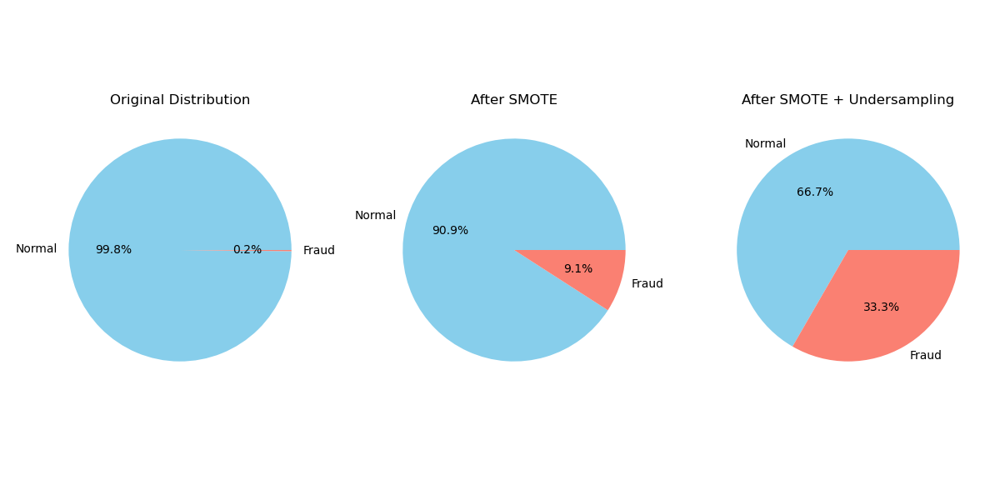
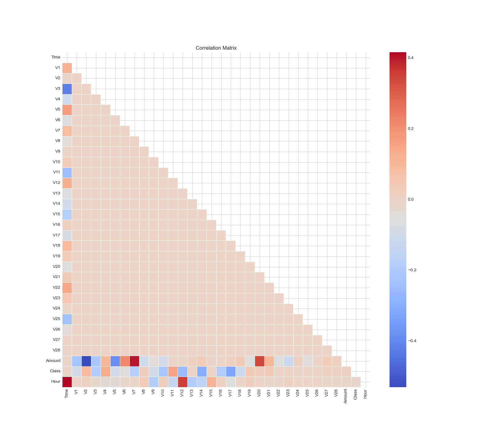
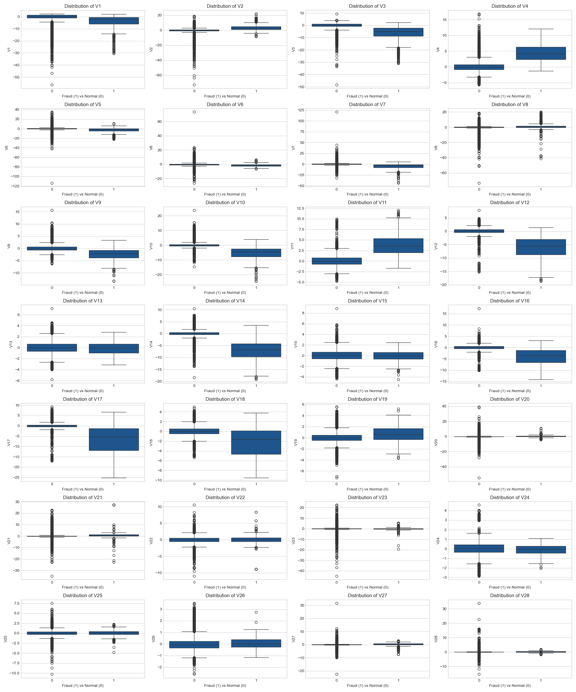
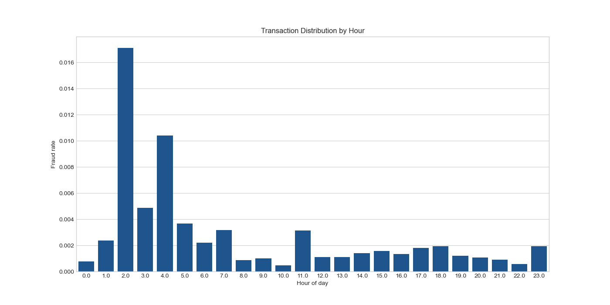
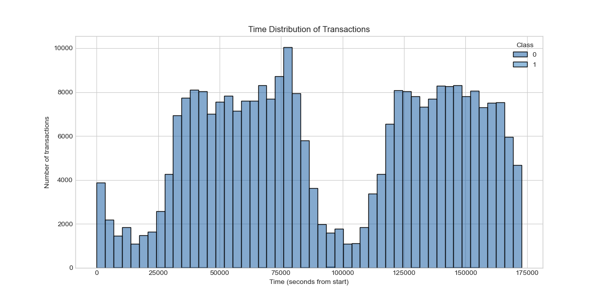

# Exploratory Data Visualizations

This directory contains the visualizations created during the exploratory data analysis phase of the fraud detection project. These visualizations help understand the underlying patterns in transaction data and identify key features for fraud detection.

## Static Visualizations

### 1. Transaction Amount Distribution (amount_distribution.png)

- **Description**: Histogram showing the distribution of transaction amounts on a logarithmic scale, separated by class (fraud vs legitimate).
- **Insights**: Fraudulent transactions tend to have different amount distributions compared to legitimate ones, with fraud concentrated in specific amount ranges.

### 2. Class Balancing Visualization (class_balance_comparison.png)

- **Description**: Pie charts showing the class distribution in the original dataset (0.2% fraud), after SMOTE (9.1% fraud), and after SMOTE + Undersampling (33.3% fraud).
- **Insights**: Demonstrates the severe class imbalance in the original dataset and how resampling techniques are applied to create more balanced training sets.

### 3. Correlation Matrix (correlation_matrix.png)

- **Description**: Heatmap showing the correlation between all variables in the dataset.
- **Insights**: Identifies relationships between features and highlights which variables may be most relevant for detecting fraudulent transactions.

### 4. Feature Distributions by Class (feature_distributions.png)

- **Description**: Box plots showing the distribution of all features (V1-V28) for fraudulent vs legitimate transactions.
- **Insights**: Reveals clear differences in feature distributions between classes, highlighting which variables have discriminative power for fraud detection.

### 5. Fraud Rate by Hour (fraud_rate_by_hour.png)

- **Description**: Bar chart showing the fraud rate by hour of the day.
- **Insights**: Identifies specific hours (especially early morning hours 2-4) with significantly higher fraud rates, suggesting temporal patterns in fraudulent activity.

### 6. PCA 2D Visualization (pca_2d.png)

- **Description**: Scatter plot showing the projection of transactions onto the first two principal components.
- **Insights**: Demonstrates how Principal Component Analysis can help visualize the separation between fraudulent and legitimate transactions in 2D space.

### 7. Time Distribution of Transactions (time_distribution.png)

- **Description**: Histogram showing the distribution of transactions over time.
- **Insights**: Reveals temporal patterns in transaction volume, with potential implications for fraud detection strategies.

## Interactive Visualizations

### 8. PCA 3D Visualization (pca_3d.html)
- **Description**: Interactive 3D scatter plot showing the projection of transactions onto the first three principal components.
- **Insights**: Provides a more comprehensive view of the data structure and potential clusters of fraudulent transactions.
- **Access**: [PCA 3D Visualization (téléchargement direct)](https://github.com/Axelle141188/fraud_detection_project/raw/main/visualizations/exploratory/pca_3d.html)
- **Usage**: Download and open this HTML file in your browser to interact with the 3D visualization.

## Summary of Findings

These visualizations collectively highlight several key patterns in fraudulent credit card transactions:

1. Fraudulent transactions show distinct distributions across multiple features
2. Temporal patterns exist, with certain hours showing significantly higher fraud rates
3. The extreme class imbalance (0.2% fraud) makes detection challenging without appropriate resampling techniques
4. Dimensionality reduction via PCA shows potential for separating fraudulent from legitimate transactions
5. Several features (particularly V1, V3, V4, V9, V10, V12, V14, and V17) show strong discriminative power for fraud detection

These insights informed the feature engineering and modeling strategies used in subsequent stages of the project.
