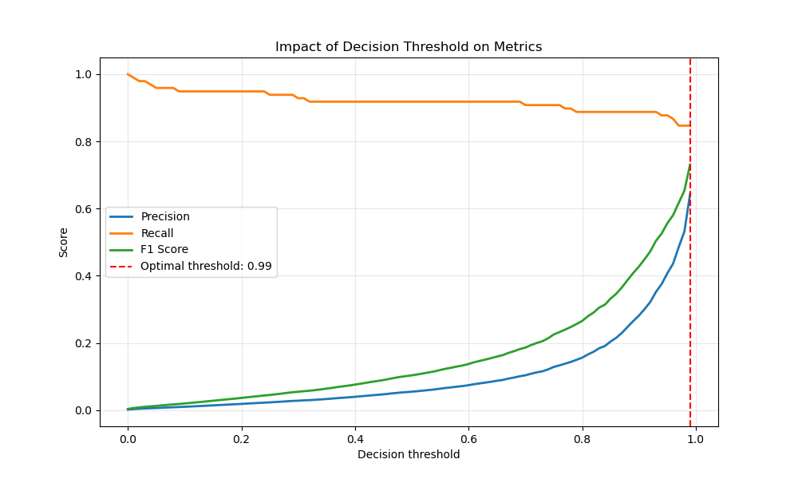

# Model Results & Performance Visualizations

This directory contains a comprehensive set of visualizations documenting the performance, feature importance, error analysis, and business impact of our fraud detection model.

## Performance Metrics & Model Comparison

### 1. Key Model Metrics (key_metrics.png)

- **Description**: Bar chart highlighting the primary model performance metrics.
- **Key Insight**: Our model achieves an impressive 84.7% fraud detection rate with only a 0.1% false alarm rate, demonstrating excellent performance on imbalanced data.

### 2. ROC Curves for Different Models (roc_curves.png)

- **Description**: Curves showing true positive rate vs. false positive rate for all tested models.
- **Key Insight**: Most models achieve excellent AUC scores (>0.97), with Gradient Boosting (Combined) and XGBoost (Combined) performing best (AUC 0.985 and 0.981 respectively).

### 3. Precision vs Recall Comparison by Model (model_comparison.png)

- **Description**: Horizontal bar chart comparing precision and recall across different models and sampling strategies.
- **Key Insight**: Logistic Regression with combined sampling achieves the highest recall but lower precision, while tree-based models provide better precision-recall balance.

### 4. Precision-Recall Curves (precision_recall_curves.png)

- **Description**: Curves showing precision-recall trade-offs for all tested models.
- **Key Insight**: Tree-based models maintain higher precision across a wider range of recall values, demonstrating greater robustness.

### 5. Impact of Decision Threshold on Metrics (threshold_metrics_impact.png)

- **Description**: Line chart showing how precision, recall, and F1 score change with different probability thresholds.
- **Key Insight**: A very high threshold (0.99) optimizes F1 score while maintaining strong recall, indicating high confidence in fraud predictions.

### 6. Confusion Matrix (confusion_matrix.png)

- **Description**: Heatmap showing model prediction performance with actual counts.
- **Key Insight**: The model correctly identifies 90 frauds (true positives) while missing only 8 frauds (false negatives), with 1,549 false positives from 55,315 normal transactions.

## Feature Importance Analysis

### 7. Feature Importance (feature_importance.png)

- **Description**: Bar chart showing the importance of each feature in the model.
- **Key Insight**: The "is_outlier" features for variables V26, V4, V14, and V12 are the most influential in detecting fraud.

### 8. SHAP Feature Importance (shap_summary.png)

- **Description**: Bar chart showing average SHAP value magnitude for each feature.
- **Key Insight**: Transaction amount has the greatest impact on predictions, followed by V4, V10, and V14. The Outlier_Count feature ranks among the top 5.

### 9. SHAP Detailed Analysis (shap_detailed.png)

- **Description**: Detailed visualization showing how feature values impact model predictions.
- **Key Insight**: Provides a deep understanding of how each feature contributes to increasing or decreasing fraud probability.

### 10. SHAP Feature Importance Alternative View (shap_feature_importance.png)

- **Description**: Alternative visualization of SHAP values showing feature importance ranking.
- **Key Insight**: Confirms the importance of transaction amount and specific V features in fraud detection.

### 11. Model Coefficients (coefficients_importance.png)

- **Description**: Bar chart showing the absolute values of model coefficients.
- **Key Insight**: Identifies the strongest predictive features in the linear components of the model.

## Fraud Patterns & Temporal Analysis

### 12. Fraud Rate by Amount Category (amount_fraud_pattern.png)

- **Description**: Bar chart showing fraud rate percentage by transaction amount category.
- **Key Insight**: Small transactions (0-10€) have significantly higher fraud rates (>25%) compared to larger transactions.

### 13. Fraud Rate and Transaction Count by Amount (amount_fraud_count.png)

- **Description**: Combined visualization showing both fraud rate (bars) and transaction count (line) by amount.
- **Key Insight**: Small transactions have both the highest fraud rate and the highest volume.

### 14. Fraud Distribution by Day and Hour (fraud_temporal_heatmap.png)

- **Description**: Heatmap showing fraud counts by hour of day and day of week.
- **Key Insight**: Specific time windows show significantly higher fraud rates, especially at 2-3AM and 11AM.

### 15. Fraud Rate by Hour of Day (hourly_fraud_pattern.png)

- **Description**: Line chart showing fraud rate percentage by hour with high-risk periods highlighted.
- **Key Insight**: Early morning hours (2-4AM) have dramatically higher fraud rates (>1.5%).

### 16. Feature Profile Comparison (feature_radar_chart.png)

- **Description**: Radar chart visualizing feature value profiles for fraudulent versus normal transactions.
- **Key Insight**: Distinct patterns emerge across key features, particularly V1, V2, V4, and V5.

### 17. Variable Distributions Comparison (feature_distributions_comparison.png)

- **Description**: Box plots comparing the distribution of key features by transaction class.
- **Key Insight**: Several features show clear separation between classes, indicating high discriminative power.

## Error Analysis

### 18. False Predictions Amount Distribution (false_predictions_amount.png)

- **Description**: Histograms showing transaction amount distributions for false positives and false negatives.
- **Key Insight**: Most false positives occur for small amounts (0-5€), while false negatives are concentrated in specific ranges.

### 19. False Predictions Hour Distribution (false_predictions_hour.png)

- **Description**: Bar charts showing the distribution of false positives and false negatives by hour of day.
- **Key Insight**: False positives are more frequent during evening hours (12-22h), while false negatives occur primarily during early morning hours.

## Business Impact Analysis

### 20. Financial Impact by Decision Threshold (threshold_optimization.png)

- **Description**: Line chart showing how different thresholds affect savings, costs, and net impact.
- **Key Insight**: The optimal threshold maximizes net savings by balancing false positives costs with missed fraud costs.

### 21. Business Impact by Decision Threshold (financial_impact_threshold.png)

- **Description**: Alternative visualization of threshold optimization showing financial impact.
- **Key Insight**: Confirms the optimal threshold finding with financial metrics.

### 22. Comparison of Fraud Detection Approaches (business_impact.png)

- **Description**: Bar chart comparing financial impact of different detection strategies.
- **Key Insight**: Our model achieves significant positive impact compared to no detection.

### 23. Detailed Business Impact by Approach (approach_impact.png)

- **Description**: Detailed financial breakdown of different detection approaches.
- **Key Insight**: Our model generates approximately $2,289 in net savings per period.

## Real-Time Monitoring Visualizations

### 24. Transaction Risk Scores (risk_score_dashboard.png)

- **Description**: Scatter plot showing risk scores for sample transactions with alert threshold line.
- **Key Insight**: Only a small percentage of transactions exceed the risk threshold (95%).

## Interactive Dashboards and Visualizations

This directory also contains interactive HTML visualizations that can be downloaded and viewed in a web browser:

### 25. Approach Comparison Dashboard (approach_comparison_dashboard.html)
- **Description**: Interactive dashboard comparing different fraud detection approaches.
- **Access**: [Approach Comparison Dashboard (téléchargement direct)](https://github.com/Axelle141188/fraud_detection_project/raw/main/visualizations/results/approach_comparison_dashboard.html)
- **Usage**: Download and open in your browser to interact with the visualization.

### 26. Business Impact Visualization (business_impact.html)
- **Description**: Interactive visualization of the business impact of fraud detection.
- **Access**: [Business Impact Visualization (téléchargement direct)](https://github.com/Axelle141188/fraud_detection_project/raw/main/visualizations/results/business_impact.html)
- **Usage**: Download and open in your browser to explore different financial metrics.

### 27. Business Impact Dashboard (business_impact_dashboard.html)
- **Description**: Comprehensive interactive dashboard for financial impact analysis.
- **Access**: [Business Impact Dashboard (téléchargement direct)](https://github.com/Axelle141188/fraud_detection_project/raw/main/visualizations/results/business_impact_dashboard.html)
- **Usage**: Download and open in your browser to explore financial metrics in depth.

### 28. Risk Score Dashboard (risk_score_dashboard.html)
- **Description**: Interactive dashboard for monitoring transaction risk scores in real-time.
- **Access**: [Risk Score Dashboard (téléchargement direct)](https://github.com/Axelle141188/fraud_detection_project/raw/main/visualizations/results/risk_score_dashboard.html)
- **Usage**: Download and open in your browser to interact with the risk monitoring system.

### 29. Risk Score Histogram (risk_score_histogram.html)
- **Description**: Interactive histogram showing the distribution of risk scores.
- **Access**: [Risk Score Histogram (téléchargement direct)](https://github.com/Axelle141188/fraud_detection_project/raw/main/visualizations/results/risk_score_histogram.html)
- **Usage**: Download and open in your browser to explore the risk score distribution.

### 30. Risk Score Scatter (risk_score_scatter.html)
- **Description**: Interactive scatter plot for detailed risk score analysis.
- **Access**: [Risk Score Scatter (téléchargement direct)](https://github.com/Axelle141188/fraud_detection_project/raw/main/visualizations/results/risk_score_scatter.html)
- **Usage**: Download and open in your browser to explore individual transaction risks.

## Implementation Recommendations

Based on these visualizations, I recommend:

1. Implement the optimized model with high threshold (0.99) for maximum precision and F1 score
2. Establish enhanced verification for transactions in high-risk hours (2-4AM)
3. Add special monitoring for small-amount transactions, which show elevated fraud rates
4. Develop specialized models for different transaction amount segments
5. Implement real-time monitoring dashboard with risk scores and pattern detection
6. Focus on Amount, V4, V10, and V14 features for rule-based supplementary checks

These visualizations demonstrate both the technical performance and business value of the fraud detection system.
